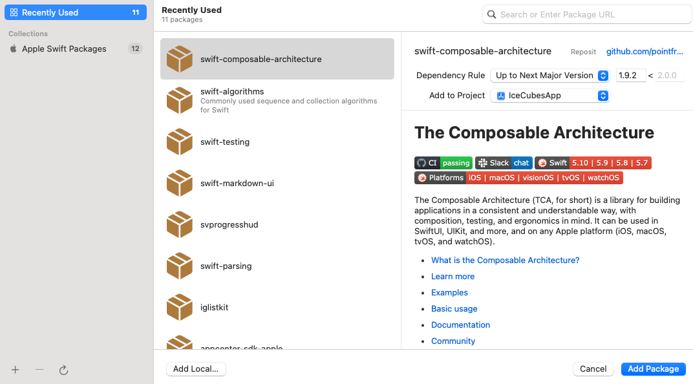
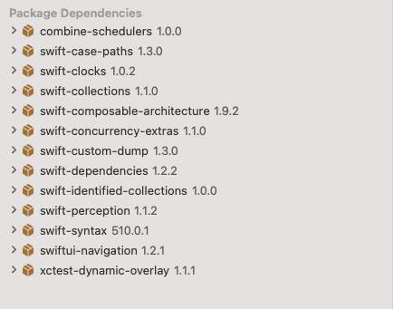
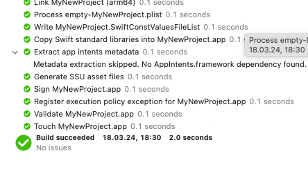
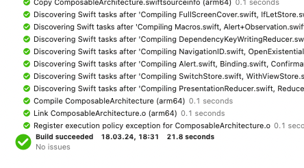
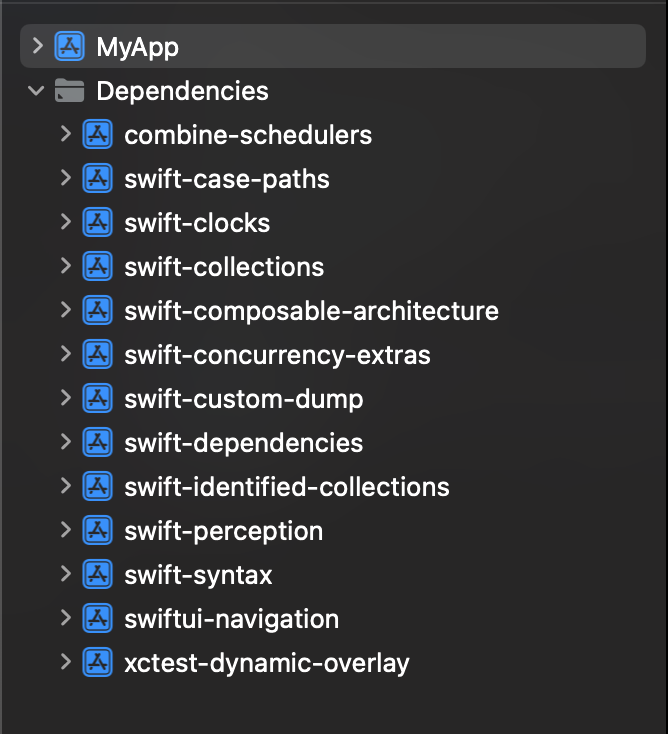
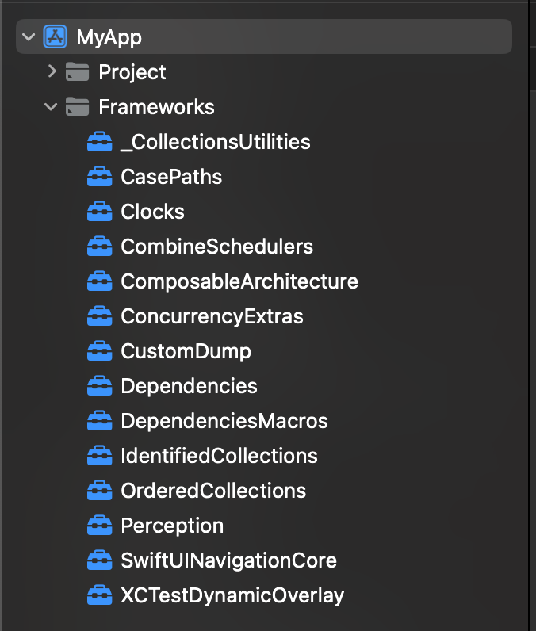
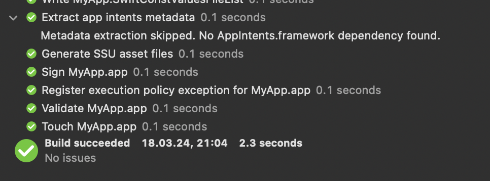
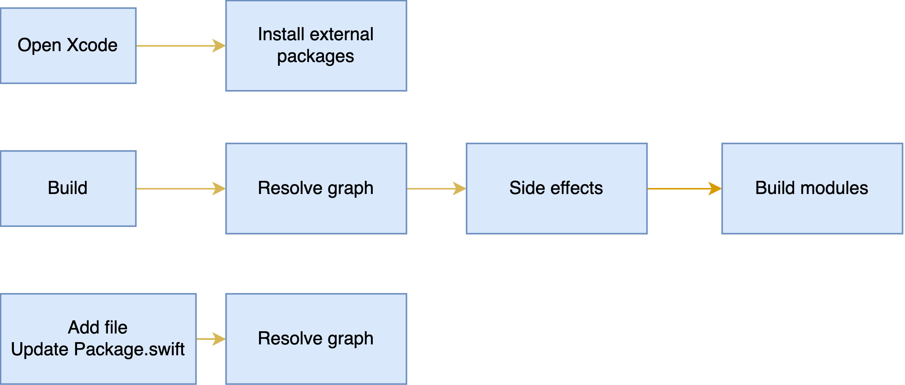
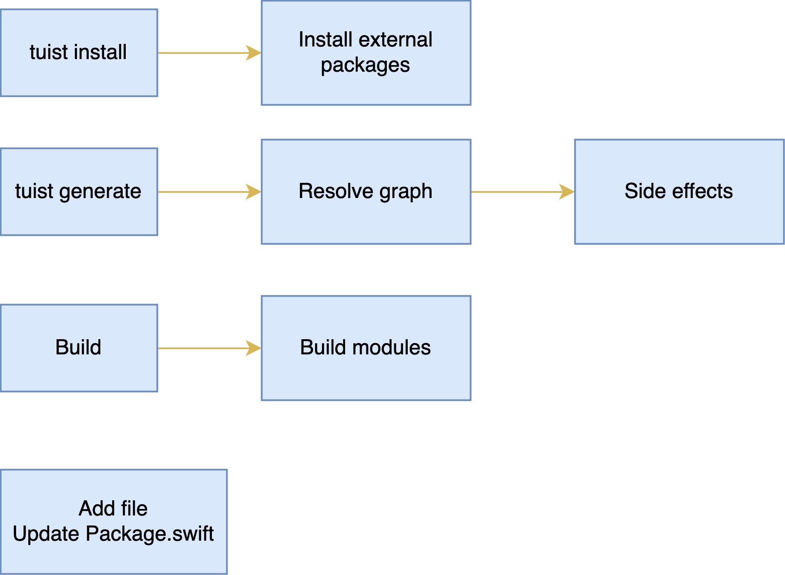
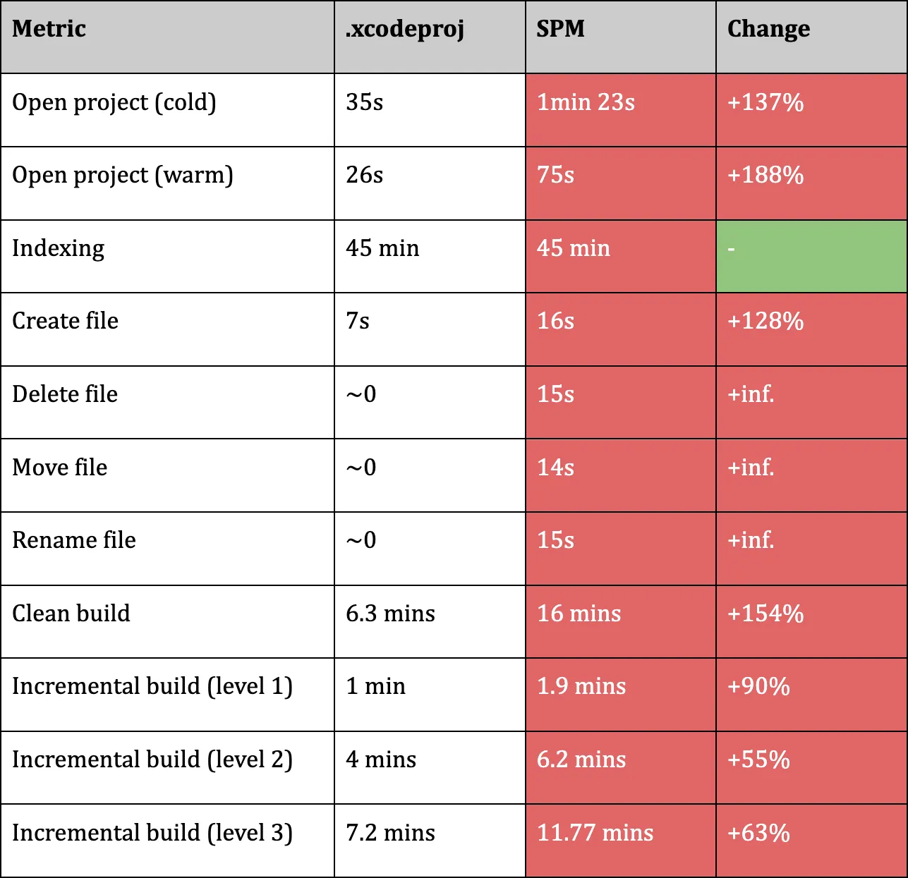

# Fixing Swift Package Manager at scale

---

## Hey 👋

- Marek Fořt
- Based in Berlin
- Core maintainer of Tuist, co-founder of Tuist Cloud

---

## Swift Package Manager use-cases

- External dependencies for an app
- Modularizing an app
- Develop a package

---

## Using SPM as a manager for external dependencies

---

## The good

- Wide selection of packages
- Tight Xcode integration
- Easy-to-use

---

## The bad

- Hard to optimise
- Clean and CI build recompilations
- `.pbxproj` diffs

---

## Let me add one dependency...



---



---

## Build time of +20 seconds





---

`.pbxproj` diff

[.code-highlight: all]
[.code-highlight: 1-12]
[.code-highlight: 12-100]

```diff
/* Begin PBXBuildFile section */
+   F8A2253E2BA8586C00D6D6E8 /* Algorithms in Frameworks */ = {isa = PBXBuildFile; productRef = F8A2253D2BA8586C00D6D6E8 /* Algorithms */; };
...
/* End PBXBuildFile section */

...

isa = PBXFrameworksBuildPhase;
buildActionMask = 2147483647;
files = (
+   F8A2253E2BA8586C00D6D6E8 /* Algorithms in Frameworks */,

...

packageReferences = (
+   F8A2253C2BA8586C00D6D6E8 /* XCRemoteSwiftPackageReference "swift-algorithms" */,

...

+ F8A2253C2BA8586C00D6D6E8 /* XCRemoteSwiftPackageReference "swift-algorithms" */ = {
+         isa = XCRemoteSwiftPackageReference;
+         repositoryURL = "https://github.com/apple/swift-algorithms.git";
+         requirement = {
+                 kind = upToNextMajorVersion;
+                 minimumVersion = 1.2.0;
+         };
+ };

+ F8A2253D2BA8586C00D6D6E8 /* Algorithms */ = {
+         isa = XCSwiftPackageProductDependency;
+         package = F8A2253C2BA8586C00D6D6E8 /* XCRemoteSwiftPackageReference "swift-algorithms" */;
+         productName = Algorithms;
+ };
```

---

`MyProject.xcodeproj/project.xcworkspace/xcshareddata/swiftpm/Package.resolved`

```diff
+ "originHash" : "106edf564c4e4ea42abffecca7659ced173d93699df9a8511c3dad2a538a6813",

...

+ {
+   "identity" : "swift-algorithms",
+   "kind" : "remoteSourceControl",
+   "location" : "https://github.com/apple/swift-algorithms.git",
+   "state" : {
+     "revision" : "f6919dfc309e7f1b56224378b11e28bab5bccc42",
+     "version" : "1.2.0"
+   }
+ },
+ {
+     "identity" : "swift-numerics",
+     "kind" : "remoteSourceControl",
+     "location" : "https://github.com/apple/swift-numerics.git",
+     "state" : {
+     "revision" : "0a5bc04095a675662cf24757cc0640aa2204253b",
+     "version" : "1.0.2"
+     }
+ },

...
```

---

## Tuist


---

## Tuist

- Project generation
- Caching, tests, and other optimizations
- SPM integration

---

## Vanilla integration of SPM dependencies in Tuist

```swift
// Project.swift
import ProjectDescription

let project = Project(
    packages: [
        .package(url: "https://github.com/pointfreeco/swift-composable-architecture", .upToNextMajor(from: "1.9.2")),
    ],
    targets: [
        .target(
            name: "IceCubesApp",
            dependencies: [
                .package(product: "ComposableArchitecture"),
            ]
        )
    ]
)
```

--- 

### Tuist SPM integration

[.code-highlight: all]
[.code-highlight: 1, 6-8]
[.code-highlight: 11, 18-20]

```swift
// Tuist/Package.swift
import PackageDescription

let package = Package(
    name: "MyPackage",
    dependencies: [
        .package(url: "https://github.com/pointfreeco/swift-composable-architecture", .upToNextMajor(from: "1.9.2")),
    ]
)

// Project.swift
import ProjectDescription

let project = Project(
    targets: [
        .target(
            name: "IceCubesApp",
            dependencies: [
                .external(name: "ComposableArchitecture"),
            ]
        )
    ]
)
```

---

## SPM package integration

- `~/Library/Developer/Xcode/DerivedData/MyProject-xxx/SourcePackages` 👉 `Tuist/.build`
- `MyProject.xcodeproj/project.pbxproj` 👉 `Tuist/Package.swift`
- `MyProject.xcodeproj/project.xcworkspace/xcshareddata/swiftpm/Package.resolved` 👉 `Tuist/Package.resolved`

---

## Specify product types of your dependencies

```swift
// Tuist/Package.swift
import PackageDescription

#if TUIST
    import ProjectDescription
    import ProjectDescriptionHelpers

    let packageSettings = PackageSettings(
        productTypes: [
            "Alamofire": .framework, // default is .staticFramework
        ]
    )
#endif

let package = Package(
    ...
```

---

```bash
tuist install # swift package resolve
tuist generate
```



---

```bash
tuist cache
tuist generate
```



---

90 % build reduction when using xcframeworks



---
## Package transformation


---

## Using SPM as a manager for modularizing an app

- Manifests in Swift
- Mostly getting rid of `.pbxproj`

---

## SPM resolution & build



---

## Tuist resolution & build



---



_Source: Scaling iOS at Bumble_

---

## What about SPM projects?

---

## What about SPM projects?
### We support those, too!

---

## Demo time 🧑‍💻

---

## Tuist packages at scale

- Resolve at generation time
- Retain control
- Caching, incremental test execution

---